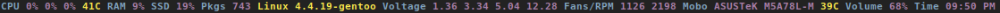

ncurses based status line/bar program.



# Installation

```bash
gcc -std=c99 -D_POSIX_C_SOURCE=200112L -Wall -Wextra -O2 ncurses.c -o pinky_curses -lncurses
```

# Usage

```bash
# ^B - Blue , ^M - Magenta , ^Y - Yellow
# ^R - Red , ^C - Cyan, ^W - White, ^G - Green
while true; do echo "^BOh ^Mhello ^Ydear, ^Rsome ^Crandom ^Wtext ^G123";sleep 1;done | ./pinky_curses

# CTRL + C to stop it
```

# Requirements

* gcc/clang
* ncurses
* glibc/libc
